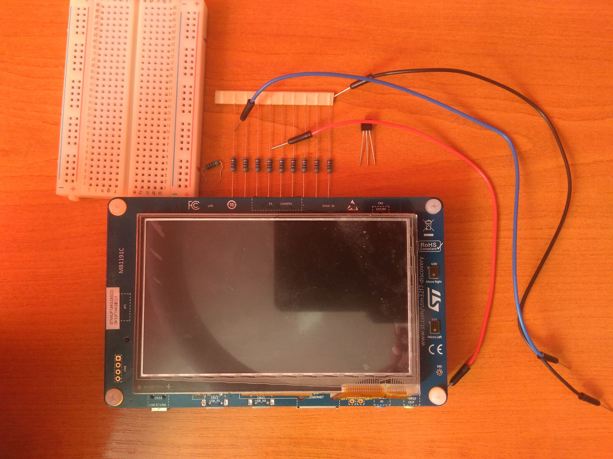
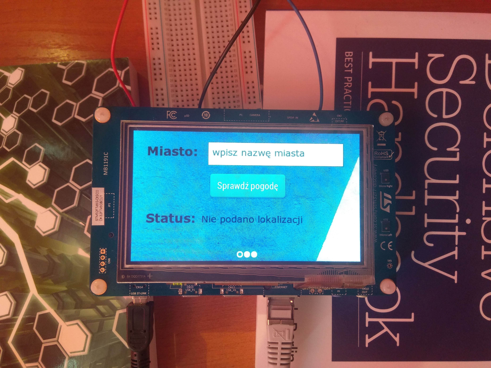
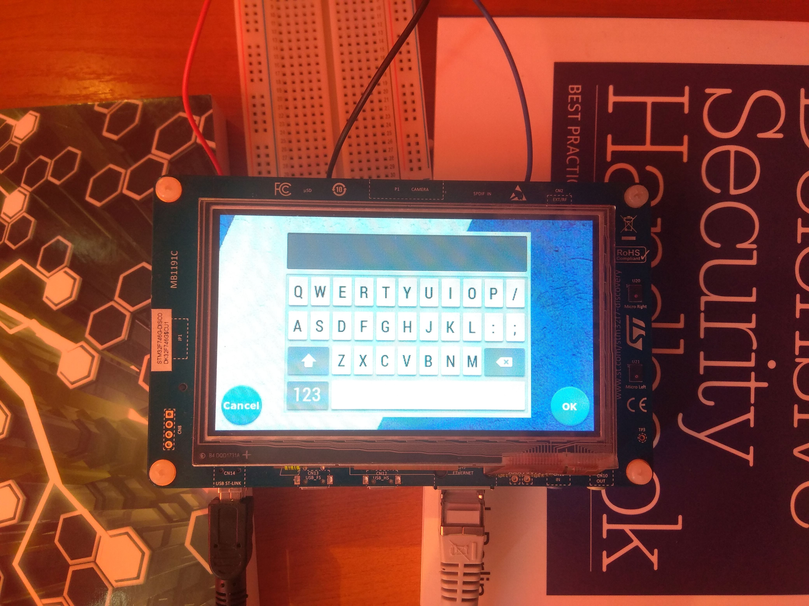
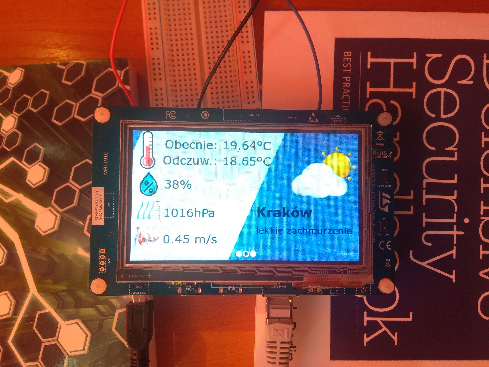
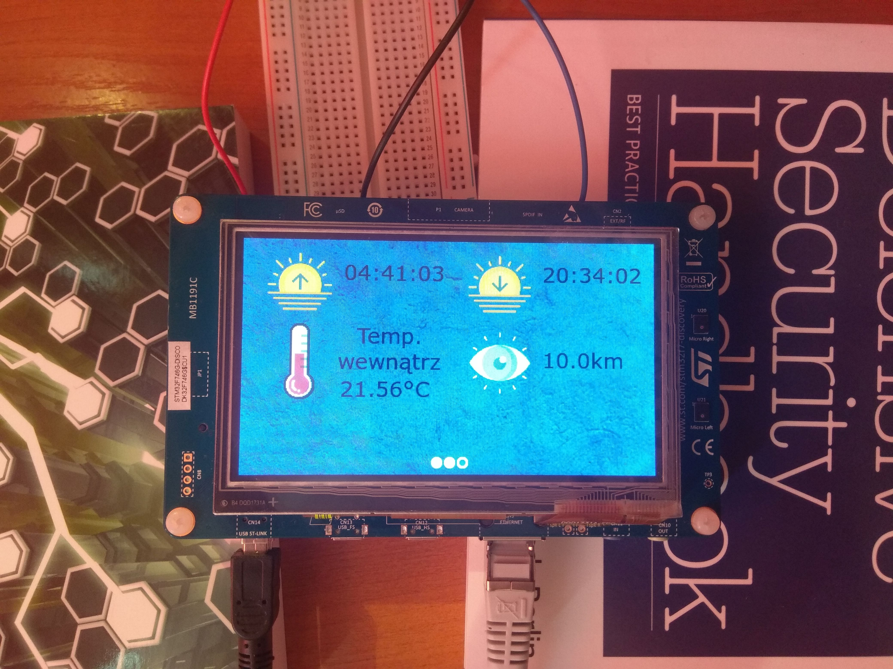
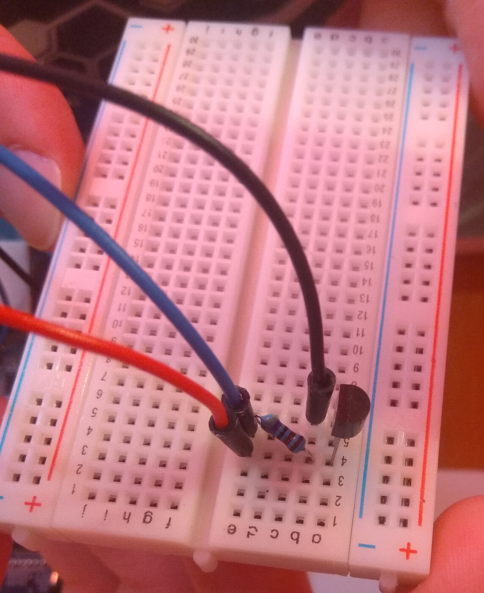

# Desktop weather station based on STM32F746G-Disco

Presentation (YouTube): [demo1](https://www.youtube.com/watch?v=MIwbDieHIio) & [demo2](https://www.youtube.com/watch?v=HRjKomDIeCw)

Full documentation is available here: [doc](./doc/final_doc.pdf)

Used equipment:
* [STM32F746G-Disco](https://www.st.com/en/evaluation-tools/32f746gdiscovery.html) device with 480x272 LCD touch panel
* [ds18b20](https://datasheets.maximintegrated.com/en/ds/DS18B20.pdf) thermometer
* weather data comes from [Open Weather Map](https://openweathermap.org/).

Graphical interface was built with [TouchGFX](https://www.st.com/content/st_com/en/ecosystems/stm32-graphic-user-interface.html) and [TouchGFX Designer](https://www.st.com/en/development-tools/touchgfxdesigner.html).

Main code is located in:
* [Headers](./STM32CubeIDE/Modules/include)
* [Sources](./STM32CubeIDE/Modules/src)

Authors:
* Albert Gierlach
* Adrian Beściak
